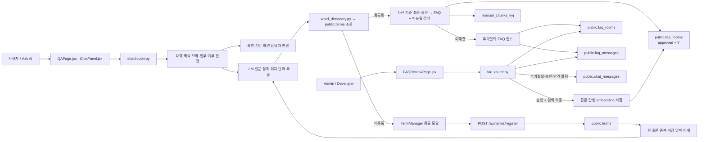
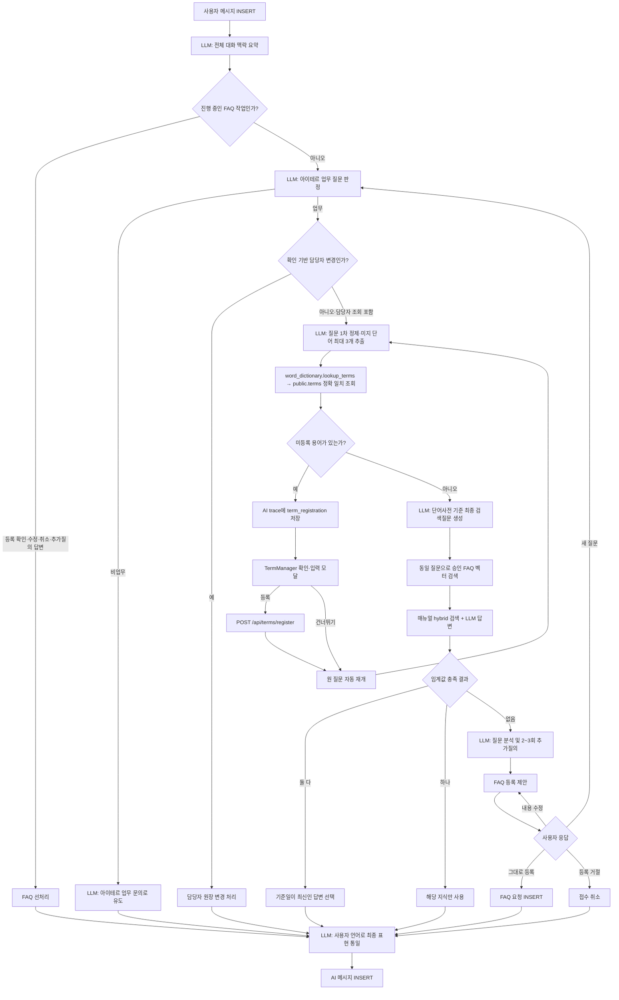
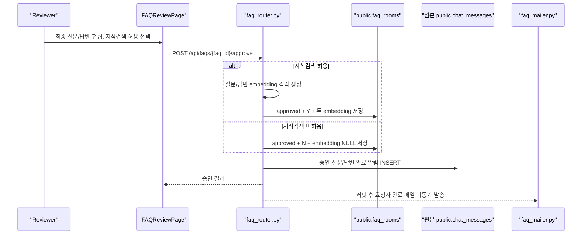

# 아이테르 Ask AI / FAQ Review 현재 구조

> 기준일: 2026-09-20
>
> 기준: `yunjin` 브랜치의 현재 `C:\Users\kkyj1\AX_ATTACK` 소스

이 문서는 아이테르의 **Ask AI 채팅**과 **FAQ Review 검수**가 어떤 테이블과 파일을 사용하며, 한 건의 질문이 어떤 순서로 처리되는지 설명한다.

## 1. 핵심 원칙

- 핵심 채팅/FAQ 원장 4개는 승인된 public 이름을 사용하고, 사용자·매뉴얼·담당자 테이블은 `_kyj` 접미사를 유지한다.
- 채팅/FAQ 및 `_kyj` 테이블명은 `backend_app/db_tables.py`에서 한 번만 정의하고 검증한다. 업무 용어 원장 `public.terms`는 현재 `backend_app/etc/terms.py`가 직접 참조한다.
- FastAPI 시작 시 테이블 또는 인덱스를 자동 생성하지 않는다. `backend_app/main.py`는 라우터 등록과 DB 스키마 오류의 JSON 변환만 담당한다.
- LangChain 기본 테이블인 `langchain_pg_collection`, `langchain_pg_embedding`은 사용하지 않는다.
- FAQ 요청과 승인 지식을 별도 원장으로 나누지 않는다. `public.faq_rooms` 한 테이블에서 상태와 지식검색 허용 여부로 구분한다.
- 채팅 종료 또는 체크포인트만으로 대화 내용을 FAQ로 자동 복제하지 않는다. 지식으로 답하지 못한 질문을 사용자가 최종 확인한 경우에만 FAQ 요청을 생성한다.
- Ask AI가 미등록 업무 용어를 발견해도 뜻을 추측하거나 자동 저장하지 않는다. 사용자가 등록 모달에서 정의를 입력해 `public.terms`에 저장한 뒤 원 질문을 자동 재개한다.

## 2. 전체 구조



## 3. 사용하는 원장(테이블)

### 3.1 핵심 채팅/FAQ/용어 테이블

| 테이블 | 역할 | 주요 읽기/쓰기 시점 |
|---|---|---|
| `public.chat_rooms` | Ask AI 채팅방 원장 | 새 대화 생성, 방 목록 조회, 첫 질문으로 제목 변경, 체크포인트 갱신 |
| `public.chat_messages` | 원본 사용자/AI 메시지 원장 | 사용자의 질문과 AI 답변 저장, FAQ 담당자의 추가질의·승인·반려 알림 전달 |
| `public.faq_rooms` | FAQ 요청·배정·승인 지식을 합친 단일 원장 | 미해결 질문 접수, 담당자 배정/재배정, 자동요약, 승인/반려, 승인 FAQ 벡터 검색 |
| `public.faq_messages` | FAQ 한 건 안에서 질문자·담당자·관리자가 주고받는 메시지 | 최초 질문/AI 요약, 답변, 추가질의, 질문자 회신, 내부 메모 저장 |
| `public.terms` | 업무 용어사전 원장 | Ask AI 미지 단어 정확 일치 조회, 사용자 확인 후 신규 용어 등록 |

### 3.2 채팅 테이블의 주요 컬럼

`public.chat_rooms`

| 컬럼 | 의미 |
|---|---|
| `room_id` | 채팅방 식별자 |
| `room_user` | 채팅방 소유 사용자명 |
| `status` | `10`이면 정상/목록 노출, `90`이면 사용자가 X로 삭제해 목록에서 숨김 |
| `title` | 최초 질문 앞 30자로 정한 방 제목 |
| `summary` | 채팅방 요약 저장 영역. 현재 실시간 답변 생성에는 직접 사용하지 않는다. |
| `last_summarized_message_id` | 마지막 체크포인트까지 처리했다고 표시한 `chat_id` |
| `regis_date`, `regis_time` | 방 생성 KST 일자 `YYYYMMDD`, 시각 `HHMMSS` |
| `last_change_date`, `last_change_time` | 최근 메시지 시각. Ask AI 방 목록 조회 시 마지막 메시지를 기준으로 동기화 |

`public.chat_messages`

| 컬럼 | 의미 |
|---|---|
| `chat_id` | 전체 채팅 메시지 식별자 |
| `room_id` | 소속 채팅방 |
| `role` | `user` 또는 `ai` |
| `text` | 메시지 본문 |
| `type` | 일반 답변/추가 확인 등 UI 표시 유형 |
| `options` | 사용자가 누를 수 있는 선택지 JSON |
| `trace` | 분기, 검색 점수, FAQ 알림 연결정보 등 처리 과정 JSON |
| `sources` | 매뉴얼/FAQ 등 답변 근거와 기준일 JSON |
| `regis_date`, `regis_time` | 메시지 생성 KST 일자와 시각 |

### 3.3 FAQ 원장의 주요 컬럼

`public.faq_rooms`

| 영역 | 컬럼 | 의미 |
|---|---|---|
| 식별/연결 | `faq_id` | FAQ 요청 식별자 |
| 식별/연결 | `requester_username` | 원 질문자 |
| 식별/연결 | `requester_chat_room_id` | 알림과 추가 답변을 주고받을 원본 Ask AI 방 |
| 검색 | `knowledge_search_allowed` | `Y`이면 승인 후 지식검색에 사용, `N`이면 완료 목록에서만 조회 |
| 질문 | `original_question` | 접수 전 원 질문 |
| 질문 | `refined_question` | 접수 과정에서 정제한 질문 |
| 분류 | `target_business` | `수신/여신/고객/외환/채널/공통/총무/카드/UMS/기타` 중 하나 |
| 분류 | `screen_number`, `country` | 화면번호와 대상 국가 |
| 배정 | `assignee_username` | 실제 `users_kyj`에 존재하는 주 담당자 계정 |
| 배정 | `assignee_display_name`, `assignee_team` | 화면 표시용 이름과 팀 |
| 배정 | `assignment_reason`, `assignment_confidence` | 배정 근거와 `높음/보통/낮음` 신뢰도 |
| 지식 | `summarized_question`, `summarized_answer` | 검수자가 최종 확정하는 FAQ 질문/답변 |
| 지식 | `summarized_question_embedding`, `summarized_answer_embedding` | 승인된 질문과 답변의 1536차원 벡터 |
| 지식 | `embedding_model` | 두 embedding을 생성할 때 사용한 config의 OpenAI embedding 모델명 |
| 지식 | `final_keywords` | 최종 검색/분류 키워드 배열 |
| 상태 | `status` | `pending`, `assigned`, `approved`, `rejected` |
| 변경 | `last_change_user`, `rejection_reason` | 마지막 변경자와 반려 사유 |
| 언어 | `lang_c` | 최초 질문에 한글이 있으면 `ko`, 그 외 언어는 `en`. FAQ LLM 정제 언어 |
| 일시 | `regis_date/time`, `last_change_date/time` | 등록 및 최종 변경 KST 일시 |

검색 대상은 다음 조건을 모두 만족해야 한다.

```sql
status = 'approved'
AND knowledge_search_allowed = 'Y'
AND (
  summarized_question_embedding IS NOT NULL
  OR summarized_answer_embedding IS NOT NULL
)
```

FAQ 벡터 검색 인덱스는 최신 테이블명 기준의
`faq_rooms_question_embedding_idx`, `faq_rooms_answer_embedding_idx`를 사용한다.
채팅/FAQ의 PK 및 일반 인덱스도 `chat_rooms_*`, `chat_messages_*`,
`faq_rooms_*`, `faq_messages_*` 접두사로 통일한다.

임베딩 모델은 `config.py`의 `OPENAI_EMBEDDING_MODEL`에서 읽고 승인 시
`faq_rooms.embedding_model`에 저장한다. 검색 시 현재 config와 같은 모델로
생성된 FAQ만 비교한다. `text-embedding-3-large`로 변경해도 기존
`vector(1536)` 컬럼과 호환되도록 출력 차원은 `OPENAI_EMBEDDING_DIMENSIONS=1536`으로 유지한다.

`public.faq_messages`

| 컬럼 | 의미 |
|---|---|
| `faq_id` | 소속 FAQ 요청 |
| `faq_chat_id` | FAQ별로 1부터 시작하는 메시지 순번. PK는 `(faq_id, faq_chat_id)` |
| `author_username`, `author_role` | 작성자와 역할(`requester`, `agent`, `assignee`, `admin`) |
| `message_type` | `question`, `summary`, `answer`, `additional_question`, `note` 등 |
| `message_text` | 메시지 본문 |
| `regis_date`, `regis_time` | KST 등록 일자와 시각 |

### 3.4 업무 용어 원장의 주요 컬럼

`public.terms`

| 컬럼 | 의미 |
|---|---|
| `term_id` | 용어 식별자 |
| `term_name` | 정식 용어명. Ask AI가 대소문자·앞뒤 공백을 무시하고 정확 일치 조회 |
| `keyword` | 쉼표로 구분한 동의어·약어. 각 항목을 분리해 정확 일치 조회 |
| `definition` | 검색질문 재작성에 사용하는 용어 정의. 필수 입력 |
| `category` | 선택 입력하는 용어 분류 |
| `created_at`, `updated_at` | 등록·수정 시각 |

LLM이 추출한 후보 중 일반 표현과 화면번호 패턴은 조회 대상에서 제외한다. 조회 결과에 정의가
없으면 `trace.term_registration`에 원 질문, 미등록 용어 목록, 현재 등록할 용어를 기록한다.

### 3.5 함께 참조하는 테이블

| 테이블 | 역할 |
|---|---|
| `public.users_kyj` | 로그인, 역할, 언어, 표시 이름, 부서, 이메일 및 FAQ 담당자 후보 제공 |
| `public.manuals_kyj` | 매뉴얼 원장 |
| `public.manual_versions_kyj` | 매뉴얼 버전과 검색 기준일 제공 |
| `public.manual_chunks_kyj` | 매뉴얼 청크 본문, 키워드 검색값, embedding 저장 |
| `public.screen_owners_kyj` | 사용자 확인을 받은 화면 담당자 변경과 FAQ 예상 담당자 배정 시 참조. Ask AI의 담당자 조회에는 직접 사용하지 않음 |
| `public.screen_owner_changes_kyj` | 사용자가 확인한 화면 담당자 변경 이력 |

### 3.6 더 이상 사용하지 않는 테이블

- `faq_registry_kyj`: 삭제됨. 승인 지식은 `public.faq_rooms`에 통합되었다.
- `faq_request_participants_kyj`: 삭제됨. FAQ는 원 질문자/원 채팅방과 일대일로 연결한다.
- `chat_answer_feedback_kyj`: 삭제됨. “도움이 되었나요?” 피드백 UI도 제거되었다.
- `langchain_pg_collection`, `langchain_pg_embedding`: 사용하지 않으며 LangChain 기본 저장소도 자동 생성하지 않는다.

## 4. 파일 목록과 역할

### 4.1 프론트엔드

| 파일 | 역할 |
|---|---|
| `frontend/src/App.jsx` | `/qa`, `/faqs`, `/term-test` 라우팅과 로그인 보호. FAQ Review는 `Admin`, `Developer`만 접근 허용 |
| `frontend/src/components/Header.jsx` | 역할에 따라 FAQ Review 메뉴 표시 |
| `frontend/src/pages/QAPage.jsx` | Ask AI 방 생성/선택/소프트 삭제 및 10초 간격 방 목록 갱신. 미확인 FAQ 알림 방을 빨간색, 확인한 방을 파란색으로 표시 |
| `frontend/src/components/ChatPanel.jsx` | 메시지 조회/전송, 15초 폴링, Markdown 답변, 선택지, 답변 근거·처리 과정 표시. `trace.term_registration`을 감지해 용어 등록 모달을 열고 등록/건너뛰기 후 원 질문을 재개 |
| `frontend/src/components/TermManager.jsx` | 신규 용어 등록 확인→입력 모달 상태 관리, `POST /api/terms/register` 호출, 등록/거절 콜백 실행 |
| `frontend/src/components/TermConfirmModal.jsx` | Ask AI가 감지한 미등록 용어를 등록할지 사용자에게 확인 |
| `frontend/src/components/TermInputModal.jsx` | 감지 용어를 기본값으로 채우고 용어명·동의어·카테고리·정의를 입력받음 |
| `frontend/src/pages/TermsTestPage.jsx` | `TermManager`를 단독 확인하는 `/term-test` 테스트 페이지 |
| `frontend/src/pages/FAQReviewPage.jsx` | 상태별 FAQ 목록, 담당자 대화, 메시지 삭제, 재배정, 자동요약, 최종 질문/답변 편집, 승인/반려 UI |
| `frontend/src/api.js` | Ask AI와 FAQ Review의 HTTP API 호출 및 JSON 오류 처리. 신규 용어 등록 후/건너뛰기 후 원 질문 재개 API 포함 |
| `frontend/src/auth.jsx` | JWT, 사용자명, 역할을 보관하고 로그인/로그아웃 상태 관리 |

### 4.2 백엔드

| 파일 | 역할 |
|---|---|
| `backend_app/main.py` | FastAPI 앱 생성, 인증/매뉴얼/채팅/FAQ/용어 라우터 등록, DB 스키마 오류를 JSON으로 반환 |
| `backend_app/db_tables.py` | 채팅/FAQ public 테이블과 `_kyj` 테이블명의 단일 정의점 및 이름 검증. `public.terms`는 아직 포함하지 않음 |
| `backend_app/db.py` | SQLAlchemy DB 연결 엔진 |
| `backend_app/config.py` | OpenAI 모델, 검색 임계값, JWT, SMTP 등 환경설정 |
| `backend_app/auth/service.py` | JWT 사용자 확인, `users_kyj` 비밀번호/역할/언어 조회 |
| `backend_app/auth/router.py` | 로그인 및 현재 사용자 API |
| `backend_app/chat/router.py` | 채팅방/메시지 API와 Ask AI 전체 분기 오케스트레이션. 용어 등록 trace에 원 사용자 메시지 ID를 연결하고 `/term-registration/resume`에서 중복 적재 없이 원 질문 재실행 |
| `backend_app/chat/workflow.py` | 각 거래 단계가 `next_action`을 반환하고 registry가 다음 함수를 선택하는 Ask AI 상태머신 |
| `backend_app/faq/intake.py` | 대화 맥락 요약, 업무 질문 판정, FAQ 언어 결정, 미해결 질문 분석, 접수 확인/수정/취소, 담당자 선정, FAQ 생성 |
| `backend_app/faq/knowledge.py` | 승인 FAQ와 매뉴얼을 모두 평가하고 임계값 및 기준일로 최종 답변 선택 |
| `backend_app/faq/search.py` | `public.faq_rooms`의 승인·검색허용 질문/답변 embedding을 검색 |
| `backend_app/rag.py` | 공통 질문 정제, 미지 단어 최대 3개 추출·필터링, 용어사전 조회, 등록 필요 목록 생성, FAQ·매뉴얼 공통 검색질문 생성, 매뉴얼 RAG 답변 |
| `backend_app/chat/word_dictionary.py` | 일반어/화면번호 후보를 제외하고 `public.terms`를 조회해 `{term, meaning, registered, lookup_error}`를 반환하는 용어사전 경계 |
| `backend_app/etc/router.py` | `POST /api/terms/register`를 받아 신규 용어 저장 함수를 호출 |
| `backend_app/etc/schemas.py` | 용어명·동의어·정의·카테고리 등록 요청 스키마 |
| `backend_app/etc/terms.py` | `public.terms` 등록·ID 조회·부분 검색·용어명/동의어 정확 일치 조회 |
| `backend_app/screen_owners.py` | 화면 담당자 변경 의도를 규칙으로 판정하고 사용자 확인 후 변경 이력 저장. 조회 요청은 지식검색으로 넘김 |
| `backend_app/faq/router.py` | FAQ 목록/상세/메시지/삭제/자동요약/재배정/승인/반려 API |
| `backend_app/faq/mailer.py` | FAQ 배정 메일과 승인 완료 메일을 Gmail SMTP로 비동기 발송하고 재시도 |
| `backend_app/chat/prompts.py` | 한국어/영어 LLM 프롬프트와 구조화 출력 설명의 중앙 관리 |

## 5. Ask AI 거래 흐름

### 5.1 채팅방 생성과 조회

1. 사용자가 **새 대화**를 누른다.
2. `POST /api/chat/rooms`가 `public.chat_rooms`에 `room_user`, `status='10'`을 넣는다.
3. 첫 질문이 오면 방 제목을 질문의 앞 30자로 바꾼다.
4. Ask AI 방 목록을 조회할 때 각 방의 마지막 `public.chat_messages` 일시를 `last_change_date/time`에 동기화한다.
5. 방 목록은 10초, 열린 방 메시지는 15초 간격으로 다시 조회한다.
6. X를 누르면 행을 물리 삭제하지 않고 `status='90'`으로 바꾸며, 목록 API는 `status='10'`인 방만 반환한다.
7. 삭제된 방에 FAQ 추가질의·승인·반려 알림이 도착하면 `status`를 `90`에서 `10`으로 복구한다. 복구된 방은 미확인 알림이므로 빨간색으로 표시되고, 사용자가 열어 확인하면 파란색으로 바뀐다.

### 5.2 메시지 한 건의 처리 순서

Ask AI의 업무 처리는 `chat/workflow.py`의 루프 실행기가 담당한다. 현재 action에
연결된 함수를 `ACTION_HANDLERS`에서 찾아 실행하고, 함수가 반환한 `next_action`으로
다음 반복을 이어간다. 응답이 완성되면 `complete`로 종료하며 최대 12단계를 넘으면
잘못된 순환으로 판단해 중단한다. 실행한 action, 함수명, 다음 action은 응답 trace에 저장한다.

새 거래 단계는 `ChatAction`에 이름을 추가하고, 단계 함수가 다음 `ChatAction`을 반환하게 만든 뒤
`ACTION_HANDLERS`에 연결한다. 따라서 라우터의 중첩 `if/else`를 다시 늘리지 않고도 다음 단계,
조기 종료 또는 이전 단계로 돌아가는 루프를 구성할 수 있다.



상세 순서는 다음과 같다.

1. 현재 방의 기존 메시지를 읽고 새 사용자 메시지를 `public.chat_messages`에 저장한다.
2. `faq_intake.summarize_conversation_context()`가 LLM으로 현재 업무 질문, 확정 사실, 대기 중 추가질의를 한 번에 요약한다.
3. `handle_pre_search_action()`이 검색보다 먼저 다음 상태를 처리한다.
   - FAQ 등록 제안에 대한 그대로 등록/내용 수정/취소/무관한 새 질문
   - 접수된 FAQ의 담당자 변경 요청
   - FAQ Review에서 전달한 추가질의에 대한 질문자 답변
4. 진행 중 FAQ 처리가 아니면 LLM이 아이테르 업무 매뉴얼 질문인지 판정한다.
   - 비업무 질문이면 현재 구현은 일반 ChatGPT 답을 제공하지 않고, 아이테르 업무 관련 질문을 해 달라고 안내한다.
   - 기존 업무 대화의 후속 답변이면 업무 문맥을 유지한다.
5. 업무 질문이면 `screen_owners.py`가 사용자 확인 기반 담당자 **변경** 요청인지만 먼저 검사한다.
6. 담당자 **조회** 질문을 포함한 나머지 질문은 LLM이 독립형 질문으로 1차 정제하면서 일반 LLM이 확신하기 어려운 내부 용어·신조어·약어·오탈자 후보를 최대 3개 추출한다.
7. 추출 단어가 없어도 `chat/word_dictionary.py`를 반드시 호출한다. 후보는 일반 표현과 화면번호를 제외한 뒤 `public.terms.term_name` 또는 쉼표로 구분한 `keyword`와 대소문자 무시 정확 일치로 조회한다.
8. 모든 후보가 등록돼 있으면 정의를 포함한 프롬프트로 최종 검색질문을 만들고 승인 FAQ와 전체 매뉴얼 검색에 동일하게 사용한다.
9. 미등록 용어가 있으면 FAQ·매뉴얼 검색 전에 `type='clarify'` AI 메시지를 저장한다. `trace.term_registration`에는 원 질문, 미등록 용어 목록, 현재 등록할 용어, 원 사용자 `chat_id`가 들어간다.
10. `ChatPanel.jsx`가 이 trace를 감지하면 `TermManager`를 자동으로 열고 현재 용어명을 미리 채운다. 사용자는 용어 등록 또는 건너뛰기를 선택한다.
11. 등록을 선택하면 `POST /api/terms/register`가 `public.terms`에 용어명·동의어·정의·카테고리를 저장한다. 등록 완료 후 `/api/chat/rooms/{room_id}/term-registration/resume`을 호출한다.
12. 재개 API는 원 사용자 메시지를 다시 INSERT하지 않고 원 질문 이전의 대화 이력을 복원해 같은 질문을 다시 실행한다. 미등록 용어가 여러 개면 다음 용어를 차례로 등록받는다.
13. 건너뛰기를 선택하면 현재 `pending_terms`를 이번 재실행에서 무시하고 원 질문 검색을 계속한다. FAQ intake 추가질의에 대한 짧은 답변은 신규 용어로 오인하지 않도록 용어 등록 분기를 잠시 비활성화한다.
14. FAQ와 매뉴얼이 모두 임계값을 충족하면 FAQ의 `last_change_date/time`과 매뉴얼 버전 `created_at`을 비교해 더 최근 근거의 답변을 사용한다. 화면에는 양쪽 출처를 함께 표시한다.
15. 한쪽만 임계값을 충족하면 “승인 FAQ 기준” 또는 “매뉴얼 기준”임을 알리고 그 답만 사용한다.
16. 둘 다 미달하면 질문을 분석하고 최대 2~3개의 추가정보를 한 번에 하나씩 묻는다. 국가가 없으면 **대상 국가를 필수로 질문**한다.
17. 추가정보까지 반영해 매 턴 지식검색을 다시 수행하고, 계속 미해결이면 FAQ 등록안을 보여준다.
18. 사용자가 그대로 등록하면 최초 질문에 한글이 있는지 판정한다. 한글이면 `ko`, 그 외 모든 언어는 `en`으로 LLM 정제를 다시 수행하고 `public.faq_rooms.lang_c`와 정제 결과를 함께 저장한다.
19. 최종 응답을 사용자의 언어로 통일한 뒤 AI 메시지를 `public.chat_messages`에 저장한다.
20. FAQ가 생성되었으면 트랜잭션 커밋 후 담당자 배정 메일을 백그라운드에서 발송한다. 메일 실패는 FAQ 접수를 롤백하지 않는다.

### 5.3 LLM 또는 embedding 호출 시점

| 시점 | 호출 | 목적 |
|---|---|---|
| 모든 사용자 메시지 | 대화 맥락 구조화 LLM | 이전 턴과 현재 턴의 업무 문맥 결합 |
| 메인 분기 진입 | 업무/비업무 판정 LLM | 매뉴얼 질문인지 분류 |
| 비업무 질문 | 일반 LLM | 자유답변이 아니라 아이테르 업무 문의 유도문 생성 |
| 지식검색 공통 전처리 | 구조화 LLM | 독립형 1차 질문과 미지 단어를 최대 3개 추출 |
| 단어사전 | Python 함수 + SQL | 매 지식검색마다 `public.terms`에서 용어명/동의어를 정확 일치 조회하고 등록 여부 판정 |
| 미등록 용어 | React 모달 + REST API | 사용자가 정의를 입력해 용어를 등록하거나 건너뛴 뒤 원 질문을 중복 저장 없이 재개 |
| 사전 기반 최종 정제 | 구조화 LLM | 단어사전 내용을 기준으로 FAQ·매뉴얼 공통 검색질문 생성 |
| FAQ 검색 | Embedding API | 공통 검색질문 벡터와 승인 FAQ 질문/답변 벡터 비교 |
| 매뉴얼 검색 | Embedding API | 같은 공통 검색질문으로 매뉴얼 청크 검색 |
| 매뉴얼 답변 | 구조화 LLM | 검색 청크만 근거로 답변 또는 추가확인 생성 |
| 지식검색 실패 | FAQ intake 구조화 LLM | 업무분류, 국가, 화면번호, 정제 질문, 담당자 단서, 부족정보 추출 |
| 등록 제안 후 자유입력 | 후속 의도 LLM + intake LLM | 확인/거절/수정/새 질문 판정, 최초 질문 기준 `ko/en` 정제 및 수정안 재작성 |
| 모든 최종 응답 | 언어 통일 LLM | DB 값이 포함되어도 사용자 언어가 섞이지 않게 정리 |

화면 담당자 조회는 FAQ·매뉴얼 지식검색으로 처리한다. 사용자 확인을 받은 담당자 변경만 규칙 판정과 SQL 갱신으로 처리한다.

### 5.4 Ask AI 예시

#### 예시 A: 승인 FAQ와 매뉴얼 중 최신 근거 선택

```text
사용자: 인도 9043 화면의 공통업무 처리방법을 알려줘.

시스템:
1) 사용자 메시지 저장
2) 업무 질문으로 판정
3) 승인 FAQ 질문/답변 embedding 검색
4) 매뉴얼 청크 검색 및 답변 생성
5) 두 결과가 기준치를 넘으면 각 기준일 비교
6) 더 최신인 쪽의 답변을 선택하고 양쪽 출처/일자를 함께 표시
7) AI 메시지 저장
```

#### 예시 B: 미해결 질문을 FAQ로 접수

```text
사용자: 9043 화면 처리방법 알려줘.
AI: 답변을 다시 찾기 위해 한 가지만 더 알려주세요. 어느 국가에서 발생한 업무인가요?
사용자: 인도야.
AI: 답변을 다시 찾기 위해 한 가지만 더 알려주세요. 어떤 업무에 해당하나요?
사용자: 공통업무야. 김연진 프로가 담당자 같아.
AI: 매뉴얼과 승인 FAQ에서 답을 찾지 못했습니다. 아래 내용으로 FAQ를 등록할까요?
사용자: 담당팀을 DS공통으로 수정해줘.
AI: 수정된 등록안을 다시 표시
사용자: 그대로 등록해줘.
AI: FAQ에 등록 완료하였습니다. 요청 번호는 #12입니다.
```

이때 `public.faq_rooms`에는 요청/업무/국가/화면/담당자 정보가 저장되고, `public.faq_messages`에는 `faq_chat_id=1` 원 질문과 `faq_chat_id=2` AI 요약이 저장된다.

#### 예시 C: 화면 담당자 변경

```text
사용자: 화면번호 1492 담당자를 홍길동으로 변경해줘.
AI: 현재 담당자와 변경 내용을 보여주고 확인 선택지를 제시
사용자: 변경 확인: 화면번호 1492 담당자를 홍길동으로 변경
시스템: screen_owners_kyj 갱신 + screen_owner_changes_kyj 이력 INSERT
AI: 변경 완료 안내
```

#### 예시 D: 미등록 용어를 먼저 등록하고 원 질문 재개

```text
사용자: 인도에서 AXT 업무는 어떻게 처리해?
시스템: LLM이 AXT를 미지 단어로 추출하고 public.terms를 조회
AI: 뜻을 확인할 수 없는 신규단어 AXT가 있으므로 먼저 등록하도록 안내
화면: TermManager가 AXT를 미리 채운 확인·입력 모달 표시
사용자: 정의와 선택 항목을 입력하고 저장
시스템: public.terms INSERT 후 원 사용자 메시지를 중복 저장하지 않고 같은 질문 재실행
AI: 등록된 AXT 정의를 반영해 FAQ·매뉴얼 검색 결과 답변
```

## 6. FAQ Review 거래 흐름

### 6.1 접근 권한과 목록

- 프론트와 백엔드 모두 `Admin`, `Developer`만 FAQ Review 접근을 허용한다.
- `Admin`은 전체 요청을 조회한다.
- `Developer`는 `assignee_username`이 자기 계정인 요청만 조회한다.
- 상태 탭은 답변 대기(`pending`), 재배정(`assigned`), 완료(`approved`), 반려(`rejected`), 전체다.

### 6.2 담당자 대화

담당자는 입력창 드롭다운에서 다음 유형을 선택한다.

| 유형 | DB 저장 | 원본 Ask AI 전달 | 메일 |
|---|---|---|---|
| 답변 작성 `answer` | `public.faq_messages` | 즉시 전달하지 않음 | 없음 |
| 질문자에게 추가질의 `additional_question` | `public.faq_messages` | `public.chat_messages`에 `faq_agent` AI 메시지로 전달 | 없음 |
| 내부 메모 `note` | `public.faq_messages` | 전달하지 않음 | 없음 |

질문자가 원본 방에서 추가질의에 답하면 Ask AI의 선처리 로직이 답변을 `public.faq_messages`에 `requester/answer`로 그대로 추가한다. FAQ 상태는 `pending` 또는 `assigned`를 유지한다.

담당자 메시지의 휴지통은 `answer`, `additional_question`, `note`만 삭제할 수 있다. 추가질의를 삭제하면 `trace`의 `faq_request_id`, `faq_chat_id`로 연결된 원본 채팅방 AI 메시지도 함께 삭제된다. 최초 질문과 시스템 요약은 삭제할 수 없다.

### 6.3 자동요약과 최종 편집

1. **자동요약**을 누르면 원본 `public.chat_messages`와 해당 FAQ의 `public.faq_messages`를 시간순으로 합친다.
2. 질문자/AI/담당자/관리자의 모든 메시지와 내부 메모까지 LLM에 전달한다.
3. 검수자 계정의 언어가 아니라 FAQ에 저장된 `lang_c`로 가장 중요한 질문, 현재까지의 답변, 키워드를 생성한다.
4. 결과를 `summarized_question`, `summarized_answer`, `final_keywords`에 저장하고 화면 입력칸에 표시한다.
5. 담당자/관리자는 승인 전까지 질문, 답변, 키워드를 자유롭게 수정할 수 있다. 승인 API에는 화면 입력칸의 최종값이 전달된다.

### 6.4 재배정

1. 담당자 후보는 `users_kyj`에서 `Admin` 또는 `Developer`인 계정만 조회한다.
2. 재배정하면 `assignee_*`, 배정 근거, 상태(`assigned`), 마지막 변경자/일시를 갱신한다.
3. 커밋 후 새 담당자 이메일로 배정 알림을 비동기 발송한다.

### 6.5 승인



- 체크박스 기본값은 켜짐이다.
- `Y`로 승인한 FAQ만 이후 Ask AI 검색 지식으로 재사용한다.
- `N`으로 승인하면 완료 목록에서는 볼 수 있지만 동일 질문 검색에는 사용하지 않는다.
- 완료된 건의 체크박스는 비활성 상태로 조회만 가능하다.
- FAQ 알림이 원본 채팅방에 들어오면 왼쪽 방 목록이 빨간색이 된다. 사용자가 그 방을 열면 브라우저 `localStorage`에 확인한 최신 메시지 ID를 저장하고 파란색으로 바뀐다.
- 승인 완료 메일은 요청자의 `users_kyj.email`로만 보낸다. 추가질의와 내부 메모에는 메일을 보내지 않는다.

### 6.6 반려

1. `status='rejected'`, 반려 사유, 마지막 변경자/일시를 저장한다.
2. 원본 채팅방에 반려 사유를 AI 메시지로 전달한다.
3. embedding을 새로 만들지 않으며 지식검색에 사용하지 않는다.
4. 현재 반려 시에는 요청자 완료 메일을 보내지 않는다.

### 6.7 FAQ Review 예시

```text
1. Developer가 FAQ 요청 #12를 연다.
2. “질문자에게 추가질의”로 오류 메시지를 요청한다.
   - FAQ 대화에 저장
   - 원본 Ask AI 방에도 AI 메시지로 전달
   - 삭제 상태였으면 원본 방을 `90`에서 `10`으로 복구하고, 방 목록은 빨간색 표시
3. 질문자가 원본 방에서 오류 메시지를 답한다.
   - FAQ 대화에 requester/answer로 저장
4. 담당자가 답변과 내부 메모를 추가한다.
5. 자동요약을 눌러 전체 원본 채팅 + FAQ 대화를 질문/답변 한 쌍으로 정리한다.
6. 담당자가 질문/답변을 직접 보정한다.
7. 지식검색 허용을 체크하고 “답변 완료 및 승인”을 누른다.
   - FAQ 요청 status=approved
   - 최종 질문/답변과 두 embedding 저장
   - 원본 방에 완료 답변 전달
   - 요청자에게 완료 메일 발송
8. 이후 유사 질문은 이 FAQ의 질문/답변 embedding 검색 대상이 된다.
```

## 7. 상태와 연결 규칙

| 상태 | 의미 | 편집 | 지식검색 |
|---|---|---|---|
| `pending` | 최초 접수/답변 대기 | 가능 | 불가 |
| `assigned` | 담당자 수동 변경/재배정 | 가능 | 불가 |
| `approved` + `Y` | 답변 완료 및 검색 허용 | 읽기 전용 | 가능 |
| `approved` + `N` | 답변 완료, 보관 전용 | 읽기 전용 | 불가 |
| `rejected` | 반려 완료 | 읽기 전용 | 불가 |

- `public.faq_rooms.requester_chat_room_id`는 `public.chat_rooms.room_id`를 `ON DELETE RESTRICT`로 참조한다. X 버튼은 행을 삭제하지 않고 `status='90'`으로만 바꾸므로 FAQ 연결은 유지된다.
- `public.faq_messages.faq_id`는 FAQ 요청을 `ON DELETE CASCADE`로 참조한다.
- 한 FAQ에는 한 원 질문자와 한 원 채팅방, 한 주 담당자 계정만 둔다. 관심 질문자 참여 테이블은 없다.

## 8. 체크포인트와 메일

### 채팅 체크포인트

- 방 전환, 방 삭제 전, 마지막 AI 답변 후 30분 비활성, 로그아웃 전 전체 방에서 호출될 수 있다.
- 체크포인트는 새 메시지 중 마지막 `chat_id`를 `last_summarized_message_id`에 기록할 뿐이다.
- 현재 체크포인트는 `summary`를 새로 만들거나 FAQ를 자동 생성하지 않는다.

### 메일

- 발신 기본값: `shds.yj.k@gmail.com`
- SMTP: `smtp.gmail.com:587`, STARTTLS
- 발송 조건: `FAQ_MAIL_ENABLED=true`이고 `FAQ_SMTP_APP_PASSWORD`가 설정되어 있어야 한다.
- 배정/재배정 메일 수신자: 담당자의 `users_kyj.email`
- 승인 완료 메일 수신자: 질문자의 `users_kyj.email`
- 발송은 DB 커밋 이후 백그라운드에서 수행하며 기본 3회 재시도한다. 실패해도 FAQ 등록/승인 트랜잭션은 취소하지 않는다.

## 9. 현재 구현상 주의할 점

- “유사한 pending 요청을 전체 FAQ에서 찾아 관심 질문자로 추가”하는 흐름은 현재 코드에 없다. 현재는 **같은 원본 채팅방**에 `pending/assigned` 요청이 있는지만 확인한다.
- `public.terms`는 현재 `db_tables.py` 상수·이름 검증 대상이 아니며 `etc/terms.py` SQL에서 직접 참조한다.
- `POST /api/terms/register`는 현재 `get_current_user` 의존성을 사용하지 않는다. 운영 환경에서 용어 등록 권한을 제한하려면 인증·역할 검사를 추가해야 한다.
- 미지 단어는 LLM 구조화 출력으로 최대 3개를 추출한다. 일반어 목록과 화면번호 패턴은 코드로 한 번 더 제외하지만, 신규 표현에 대한 오탐 가능성은 사용자 확인 모달로 통제한다.
- 승인 FAQ 검색 기본 임계값은 `0.84`, 매뉴얼 검색 기본 임계값은 `0.70`이며 환경변수로 바꿀 수 있다.
- FAQ 기준일은 `last_change_date/time`, 매뉴얼 기준일은 `manual_versions_kyj.created_at`이다.
- 매뉴얼 검색 점수는 벡터 유사도 70%와 키워드 점수 30%의 결합값이다.
- `public.faq_rooms`에 승인 FAQ가 통합되었으므로 FAQ Review의 수정과 Ask AI 검색은 같은 원장을 바라본다.
- 스키마 변경 SQL은 서버가 자동 실행하지 않는다. 향후 DDL이나 `INSERT/SELECT` 외 DB 변경은 반드시 사전 승인 후 별도로 실행해야 한다.
