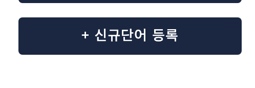

# 1. 신규 단어 등록

> 새로운 용어를 등록하고 DB에 저장하는 기능입니다.

---

## 접근 방법

### 방법 1. URL 직접 접근

`접속 도메인/term-test`

### 방법 2. ASK AI 메뉴에서 접근

**ASK AI 메뉴 → 왼쪽 사이드바 → `+ 신규단어 등록`**

---

## 신규 단어 등록 흐름

```text
┌─────────────────────────────┐
│      ASK AI 메뉴            │
│       왼쪽 사이드바         │
└──────────────┬──────────────┘
               │
               ▼
┌─────────────────────────────┐
│      + 신규단어 등록         │
└──────────────┬──────────────┘
               │
               ▼
┌─────────────────────────────┐
│      등록하시겠습니까?       │
└──────────────┬──────────────┘
               │ 예
               ▼
┌─────────────────────────────┐
│ 신규단어 / 동의어 / 카테고리 │
│          / 설명 입력         │
└──────────────┬──────────────┘
               │ 저장
               ▼
┌─────────────────────────────┐
│  TermManager.handleSubmit() │
└──────────────┬──────────────┘
               │
               ▼
┌─────────────────────────────┐
│ POST /api/terms/register    │
└──────────────┬──────────────┘
               │
               ▼
┌─────────────────────────────┐
│      FastAPI router.py      │
└──────────────┬──────────────┘
               │
               ▼
┌─────────────────────────────┐
│         create_term()       │
└──────────────┬──────────────┘
               │
               ▼
┌─────────────────────────────┐
│       INSERT INTO TERMS     │
└──────────────┬──────────────┘
               │
               ▼
        ✅ DB 저장 완료
```

---

## 📝 입력 항목

| 항목       | 필수 여부 | 설명            |
| -------- | :---: | ------------- |
| 신규단어     |   ✅   | 등록할 용어        |
| 동의어 및 약어 |   ❌   | 용어의 동의어 또는 약어 |
| 카테고리     |   ❌   | 용어의 분류        |
| 설명       |   ✅   | 용어에 대한 상세 설명  |


## 📌 신규 단어 조회/등록 API 호출하는 방법 (FAQ 담당자 확인**)
#### 1) 조회 : frontend/src/api.js --> findTerm(inputword) 함수 호출
>> 원하는 대화시점에 호출 부탁드려요


**[가져오는 법 예시]**

GET /api/terms/find?inputword=OTP

``` 
-- 채팅화면에서 가져오기 (ChatPanel.jsx 이려나요?)
const result = await findTerm("외환예금");


-- 어떤식으로 출력데이터 뿌려줄지는 몰라서.. 일단 콘솔데이터로 예시 들었어요!
if (result.success) {
  console.log(result.term);
}
```

```응답결과
{
  "success": true,
  "term": {
    "term_id": 1,
    "term_name": "외환예금",
    "keyword": "외화예금, 달러예금",
    "definition": "고객이 원화가 아닌 외국환(미국 달러, 유로 등)으로 예치하고 인출하는 수신 및 외환 상품입니다.",
    "category": "외환",
  }
}
```

#### 2) 등록 : TermManager.jsx 호출
>> 원하는 대화 시점에 등록 버튼 호출 부탁 드려요!





**[가져오는 법 예시]**

```
import TermManager from '..사용경로 /components/TermManager'

<TermManager />
```
---


# 2. 신규 단어 조회

> 신규 단어 등록 내역을 조회할 수 있습니다.

---

## 접근 권한
관리자

## 접근 방법
`접속 도메인/terms`
**상단 네비게이션 메뉴 → `TERMS (관리자 권한만 보임)`**
---